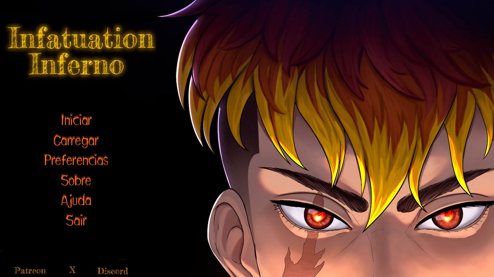
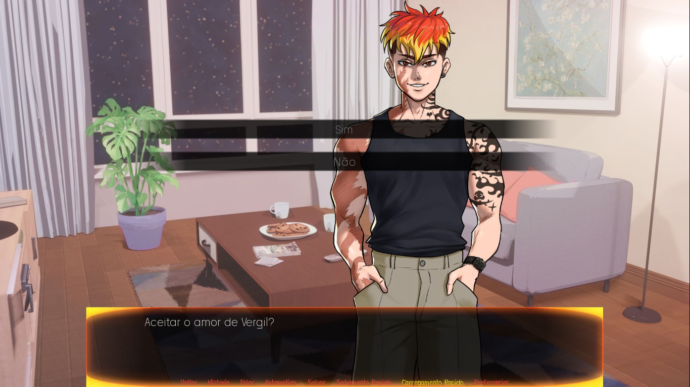
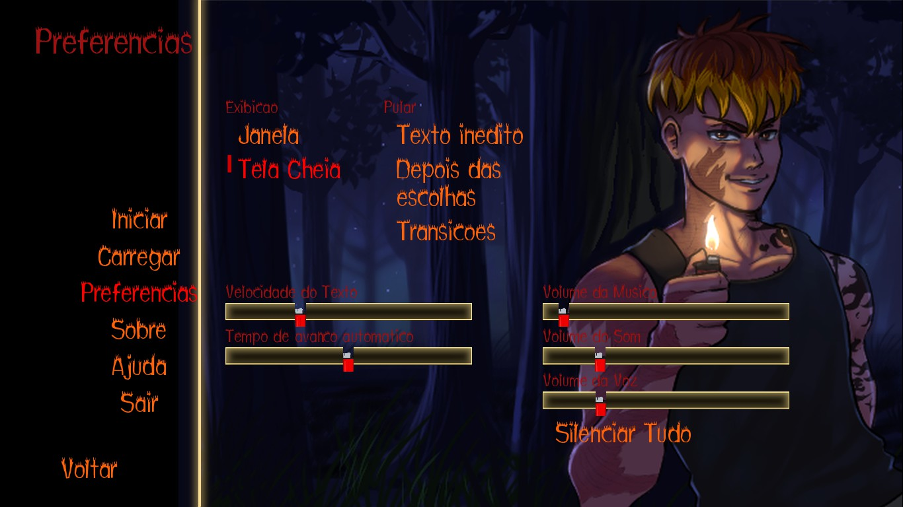

# Infatuation Inferno — Brazilian Portuguese Localization


An unofficial **Brazilian Portuguese (PT-BR)** localization for **Infatuation Inferno**.

This project was created to provide Brazilian players with a natural reading experience while preserving the tone, personality, and atmosphere of the original game.

---

## 📂 Repository Structure

| Information | Details |
|-------------|---------|
| **Game** | Infatuation Inferno |
| **Language** | English → Brazilian Portuguese |
| **Engine** | Ren'Py |
| **Status** | ✅ Complete |
| **Game Version** | v1.1 |

---

## ✨ Localization Goals

This project aims to:

- Translate the entire game into Brazilian Portuguese.
- Adapt expressions naturally instead of relying on literal translations.
- Preserve the original tone, humor, and emotional impact.
- Provide a polished and consistent experience for Brazilian players.

---

## 📁 Project Structure

```text
game/
└── tl/
    └── portuguese/
```

This repository contains all localization files for the Brazilian Portuguese version.

---

## 🤝 For the Developer

If you're interested in adding this localization as an official language option, I'd be happy to share the project and assist with any necessary adjustments for official implementation.

---

## 👤 Credits

Brazilian Portuguese localization by **Seralyth**.

---

## 📸 Screenshots

### Main Menu



### Dialogue


### Dialogue


### Choice Screen



### Settings



---

## 📄 License

This localization is licensed under the **Creative Commons Attribution-NonCommercial 4.0 International (CC BY-NC 4.0)**.

The license applies **only** to the localization files included in this repository.

**Infatuation Inferno**, its assets, characters, trademarks, and all other intellectual property remain the property of their respective developer(s).

For more information, see the `LICENSE` file.